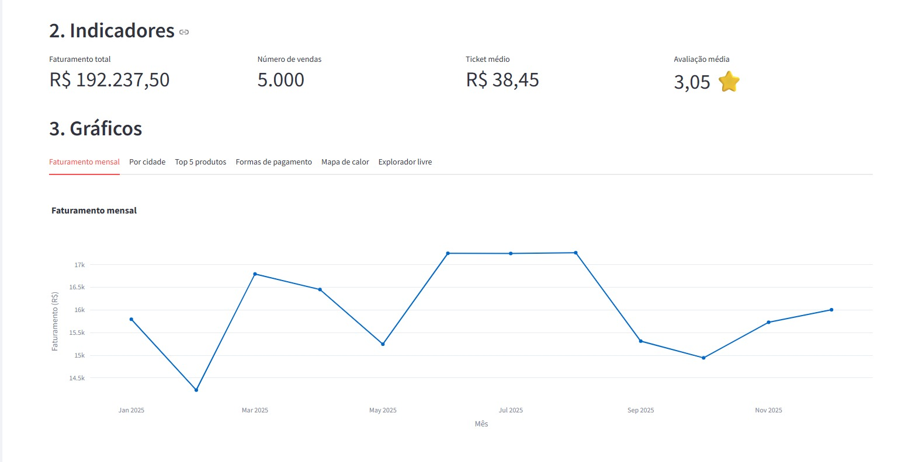

# Painel de Vendas: Sabor do Sertão

Painel interativo em Streamlit para analisar um ano de vendas da rede fictícia Sabor do Sertão (Recife, Olinda, Caruaru, Petrolina e Garanhuns).

## Como rodar

```bash
pip install -r requirements.txt
python gerar_dados.py          # gera vendas_sabor_do_sertao.csv
streamlit run app.py
```

Depois, envie o `vendas_sabor_do_sertao.csv` pela barra lateral.

## O que o painel tem

- **Exploração:** primeiras linhas, `describe()`, ausentes por coluna e tratamento de `avaliacao` (mediana).
- **KPIs:** faturamento total, número de vendas, ticket médio e avaliação média.
- **Filtros:** cidade, categoria e período, aplicados a todos os KPIs e gráficos.
- **Gráficos (abas):** faturamento mensal, por cidade, top 5 produtos, formas de pagamento e mapa de calor (dia da semana x hora).
- **Insights** calculados dinamicamente e **download** do CSV filtrado.
- **Bônus:** aba "Explorador livre" com qualquer CSV, escolha de eixos, tipo de gráfico e agregação.

## Print do painel



## Autores

Dupla: _Wendel Brasiliano & Matheus Goes_
